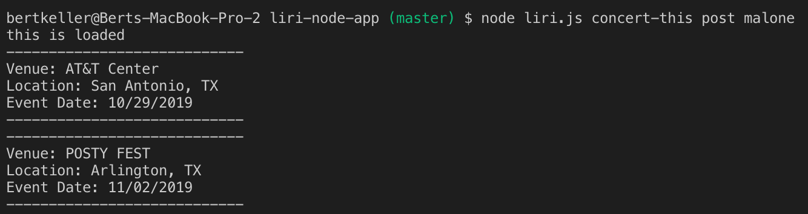
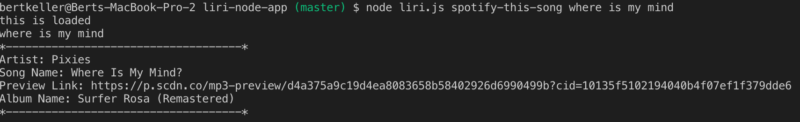
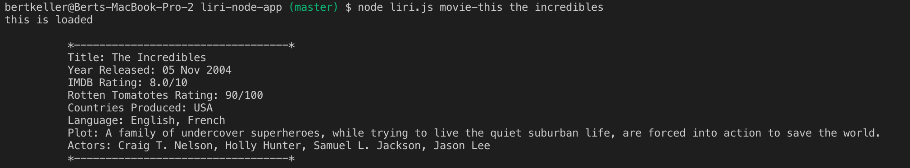

# Liri Node App

#### In this applicaiton, we will create an application from the terminal called "Liri". LIRI is a Language Interpretation and Recognition Interface. LIRI will be a command line node app that takes in parameters and gives you back data.

1. LIRI will search Spotify for songs, Bands in Town for concerts, and OMDB for movies.

2. LIRI app utilizes the Axios package to retrieve information from the Bands in Town, Spotify, and OMDB Api's, in addiiton to these other
node packages

    * Moment

    * DoteEnv

    * Axios

    * Node-spotify-API

### What each command does

    1. node liri.js concert-this <artist/band name here>

    This will search the Bands in Town Artist Events API ("https://rest.bandsintown.com/artists/" + artist + "/events?app_id=codingbootcamp")for an artist and render the following information about each event to the terminal:

        * Name of the venue

        * Venue location

        * Date of the Event (use moment to format this as "MM/DD/YYYY")

    

    2. node liri.js spotify-this-song '<song name here>'
    This will show the following information about the song in your terminal/bash window

        * Artist(s)

        * The song's name

        * A preview link of the song from Spotify

        * The album that the song is from

        

    3. node liri.js movie-this '<movie name here>'

    This will output the following information to your terminal/bash window:
        * Title of the movie.
        * Year the movie came out.
        * IMDB Rating of the movie.
        * Rotten Tomatoes Rating of the movie.
        * Country where the movie was produced.
        * Language of the movie.
        * Plot of the movie.
        * Actors in the movie.

        

    4.node liri.js do-what-it-says

        * Using the fs Node package, LIRI will take the text inside of random.txt and then use it to call one of LIRI's commands.

        * It should run spotify-this-song for "I Want it That Way," as follows the text in random.txt.

        * Edit the text in random.txt to test out the feature for movie-this and concert-this.

